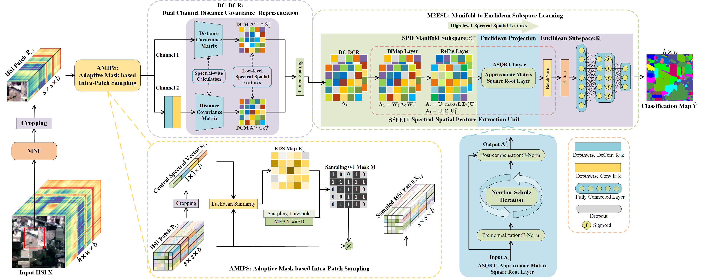

[](https://paperswithcode.com/sota/hyperspectral-image-classification-on-indian?p=adaptive-mask-sampling-and-manifold-to)

[](https://paperswithcode.com/sota/hyperspectral-image-classification-on-pavia?p=adaptive-mask-sampling-and-manifold-to)

[](https://paperswithcode.com/sota/hyperspectral-image-classification-on-casi?p=adaptive-mask-sampling-and-manifold-to)

[](https://paperswithcode.com/sota/hyperspectral-image-classification-on-houston?p=adaptive-mask-sampling-and-manifold-to)


# Adaptive Mask Sampling and Manifold to Euclidean Subspace Learning with Distance Covariance Representation for Hyperspectral Image Classification

[Mingsong Li](https://lms-07.github.io/), [Wei Li](https://fdss.bit.edu.cn/yjdw/js/b153191.htm), Yikun Liu, [Yuwen Huang](https://jsj.hezeu.edu.cn/info/1302/6525.htm), and [Gongping Yang](https://faculty.sdu.edu.cn/gpyang)

[Time Lab](https://time.sdu.edu.cn/), [SDU](https://www.sdu.edu.cn/) ; [BIT](https://www.bit.edu.cn/)

-----------
This repository is the official implementation of our paper:
[Adaptive Mask Sampling and Manifold to Euclidean Subspace Learning with Distance Covariance Representation for Hyperspectral Image Classification](https://doi.org/10.1109/TGRS.2023.3265388), IEEE Transactions on Geoscience and Remote Sensing (TGRS) 2023.

## Contents
1. [Brief Introduction](#Brief-Introduction)
1. [Environment](#Environment)
1. [Datasets and File Hierarchy](#Datasets-and-File-Hierarchy)
1. [Implementations of Compared Methods](#Implementations-of-Compared-Methods)
1. [Citation](#Citation)
1. [License and Acknowledgement](License-and-Acknowledgement)

## Brief Introduction
> <p align="left">For the abundant spectral and spatial information recorded in hyperspectral images (HSIs), fully exploring spectral-spatial relationships has attracted widespread attention in hyperspectral image classification (HSIC) community. However, there are still some intractable obstructs. For one thing, in the patch-based processing pattern, some spatial neighbor pixels are often inconsistent with the central pixel in land-cover class. For another thing, linear and nonlinear correlations between different spectral bands are vital yet tough for representing and excavating. To overcome these mentioned issues, an adaptive mask sampling and manifold to Euclidean subspace learning (AMS-M2ESL) framework is proposed for HSIC. Specifically, an adaptive mask based intra-patch sampling (AMIPS) module is firstly formulated for intra-patch sampling in an adaptive mask manner based on central spectral vector oriented spatial relationships. Subsequently, based on distance covariance  descriptor, a dual channel distance covariance representation (DC-DCR) module is proposed for modeling unified spectral-spatial feature representations and exploring spectral-spatial relationships, especially linear and nonlinear interdependence in spectral domain. Furthermore, considering that distance covariance matrix lies on the symmetric positive definite (SPD) manifold, we implement a manifold to Euclidean subspace learning (M2ESL) module respecting Riemannian geometry of SPD manifold for high-level spectral-spatial feature learning. Additionally, we introduce an approximate matrix square-root (ASQRT) layer for efficient Euclidean subspace projection. Extensive experimental results on three popular HSI datasets with limited training samples demonstrate the superior performance of the proposed method compared with other state-of-the-art methods. The source code is available at https://github.com/lms-07/AMS-M2ESL.</p>

<center> AMS-M2ESL Framework  </center>



## Environment
- The software environment is Ubuntu 18.04.5 LTS 64 bit.
- This project is running on a single Nvidia GeForce RTX 3090 GPU based on Cuda 11.0.
- We adopt Python 3.8.5, PyTorch 1.10.0+cu111.
- The py+torch combination may not limited by our adopted one.


## Datasets and File Hierarchy

Three representative HSI datasets are adopted in our experiments, i.e., Indian Pines (IP), University of Pavia (UP), and University of Houston 13 (UH).
The first two datasets could be accessed through [link1](http://www.ehu.eus/ccwintco/index.php?title=Hyperspectral_Remote_Sensing_Scenes##anomaly_detection),
and the UH dataset through [link2](https://hyperspectral.ee.uh.edu/?page_id=459).
Our project is organized as follows:

```text
AMS-M2ESL
|-- process_xxx     // main files 1) dl for the proposed model 2) cls_c_model 
|                      for the classic compared model, SVM 3) dl_c_model for eight 
|                      dl based compared methods 4) disjoint for the 
|                      disjoint dataset (UH) 5) m_scale for the multiscale model, MCM-CNN
|-- c_model         // eight deep learning based compared methods
|-- data                    
|   |-- IP
|   |   |-- Indian_pines_corrected.mat
|   |   |-- Indian_pines_gt.mat
|   |-- UP
|   |   |-- PaviaU.mat
|   |   |-- PaviaU_gt.mat
|   |-- HU13_tif
|   |   |--Houston13_data.mat
|   |   |--Houston13_gt_train.mat
|   |   |--Houston13_gt_test.mat
|-- model           // the proposed method
|-- output
|   |-- cls_maps    // classification map visualizations 
|   |-- results     // classification result files
|-- src             // source files
|-- utils           // data loading, processing, and evaluating
|-- visual          // cls maps visual
```
## Implementations of Compared Methods
For comparisons, our codebase also includes related compared methods.
- SVM, PyTorch version, sklearn-based
- J-Play, [Joint & Progressive Learning from High-Dimensional Data for Multi-Label Classification](https://openaccess.thecvf.com/content_ECCV_2018/html/Danfeng_Hong_Joint__Progressive_ECCV_2018_paper.html) ECCV 2018, referring to official Matlab version, https://github.com/danfenghong/ECCV2018_J-Play
- 1D-CNN, [Deep Convolutional Neural Networks for Hyperspectral Image Classification](https://www.hindawi.com/journals/js/2015/258619/) Journal of Sensors 2015, from a HSIC Tool Codebase, https://github.com/eecn/Hyperspectral-Classification
- MCM-CNN, [Feature Extraction With Multiscale Covariance Maps for Hyperspectral Image Classification](https://ieeexplore.ieee.org/document/9565208) TGRS 2018, ***our unofficial PyTorch implementation*** based on official Matlab version, https://github.com/henanjun/demo_MCMs
- SSTN, [Spectral-Spatial Transformer Network for Hyperspectral Image Classification: A Factorized Architecture Search Framework](https://ieeexplore.ieee.org/document/9565208) TGRS 2021, from official PyTorch version, https://github.com/zilongzhong/SSTN/blob/main/NetworksBlocks.py
- SSSAN, [Spectral–Spatial Self-Attention Networks for Hyperspectral Image Classification](https://ieeexplore.ieee.org/document/9508777) TGRS 2021, ***our unofficial PyTorch implementation*** based on the part of source Keras code from the author Dr. Xuming Zhang
- SSAtt, [Hyperspectral Image Classification With Attention-Aided CNNs](https://ieeexplore.ieee.org/abstract/document/9142417) TGRS 2020, from a PyTorch implementation, https://github.com/weecology/DeepTreeAttention/blob/main/src/models/Hang2020.py
- A2S2K-ResNet, [Attention-Based Adaptive Spectral-Spatial Kernel ResNet for Hyperspectral Image Classification](https://ieeexplore.ieee.org/document/9306920) TGRS 2020, from official PyTorch version, https://github.com/suvojit-0x55aa/A2S2K-ResNet/blob/master/A2S2KResNet/A2S2KResNet.py
- SSFTT, [Spectral–Spatial Feature Tokenization Transformer for Hyperspectral Image Classification](https://ieeexplore.ieee.org/document/9684381) TGRS 2022, from official PyTorch version, https://github.com/zgr6010/HSI_SSFTT/blob/main/cls_SSFTT_IP/SSFTTnet.py
- ASPN, [Attention-Based Second-Order Pooling Network for Hyperspectral Image Classification](https://ieeexplore.ieee.org/document/9325094) TGRS 2021, ***our unofficial PyTorch implementation*** based on official Keras version, https://github.com/mengxue-rs/a-spn

## Citation

Please kindly cite our work if this work is helpful for your research.

[1] M. Li, W. Li, Y. Liu, Y. Huang and G. Yang, "Adaptive Mask Sampling and Manifold to Euclidean Subspace Learning with Distance Covariance Representation for Hyperspectral Image Classification," in IEEE Transactions on Geoscience and Remote Sensing, doi: 10.1109/TGRS.2023.3265388.

BibTex entry:
```text
@article{li2023adaptive,
  title={Adaptive Mask Sampling and Manifold to Euclidean Subspace Learning with Distance Covariance Representation for Hyperspectral Image Classification},
  author={Li, Mingsong and Li, Wei and Liu, Yikun and Huang, Yuwen and Yang, Gongping},
  journal={IEEE Transactions on Geoscience and Remote Sensing},
  year={2023},
  doi={10.1109/TGRS.2023.3265388},
  publisher={IEEE},
}
```

## Contact information

If you have any problem, please do not hesitate to contact us `msli@mail.sdu.edu.cn`.

## License and Acknowledgement

- This project is released under [GPLv3](http://www.gnu.org/licenses/) license.
- We would like to thank the Hyperspectral Image Analysis group and the NSF Funded Center for
  Airborne Laser Mapping (NCALM) at the University of Houston for providing the UH dataset used in this work.
- Our HSIC framework is implemented based on our prior work [CVSSN](https://github.com/lms-07/CVSSN).
- Our proposed AMS-M2ESL framework is inspired by the following awesome works:
  - [Brownian distance covariance](https://projecteuclid.org/journals/annals-of-applied-statistics/volume-3/issue-4/Brownian-distance-covariance/10.1214/09-AOAS312.full), Ann. Appl. Stat. 2009
  - [Joint Distribution Matters: Deep Brownian Distance Covariance for Few-Shot Classification](https://openaccess.thecvf.com/content/CVPR2022/html/Xie_Joint_Distribution_Matters_Deep_Brownian_Distance_Covariance_for_Few-Shot_Classification_CVPR_2022_paper.html), CVPR 2022
  - [Superpixel-Based Brownian Descriptor for Hyperspectral Image Classification](https://ieeexplore.ieee.org/document/9645390?arnumber=9645390), TGRS 2021
  - [A Riemannian Network for SPD Matrix Learning](https://ojs.aaai.org/index.php/AAAI/article/view/10866), AAAI 2017
  - [Riemannian batch normalization for SPD neural networks](https://proceedings.neurips.cc/paper/2019/hash/6e69ebbfad976d4637bb4b39de261bf7-Abstract.html), NeurIPS 2019
  - [Towards Faster Training of Global Covariance Pooling Networks by Iterative Matrix Square Root Normalization](https://openaccess.thecvf.com/content_cvpr_2018/html/Li_Towards_Faster_Training_CVPR_2018_paper.html), CVPR 2018
  - [COSONet: Compact Second-Order Network for Video Face Recognition](https://link.springer.com/chapter/10.1007/978-3-030-20893-6_4), ACCV 2018
  
